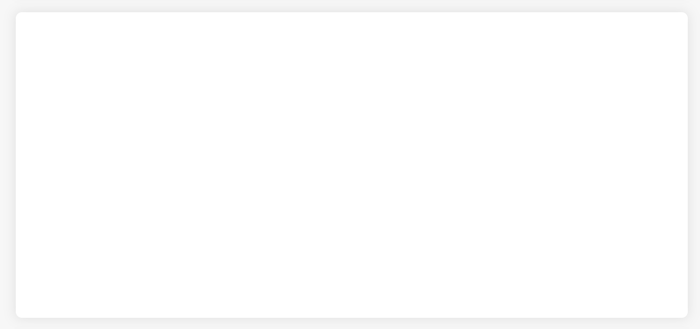
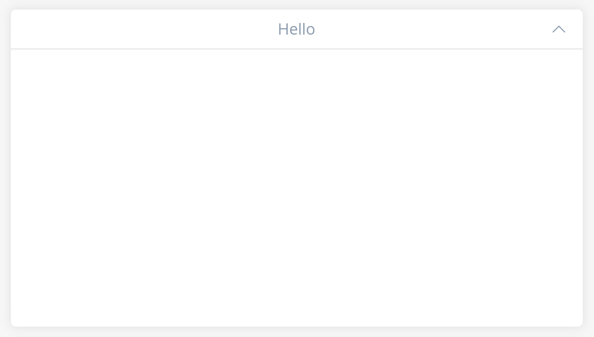

This package provide a single access to a ui kit and style guidelines for Flutter projects. Other than theme and loader management, the package contains also some useful custom standard widgets.

## Features

This package contains:

* **Light and Dark theme management and preference saving**
<br>

The package provides a definition for color and styles in case of dark or light theme. It also contains a `ThemeProvider` to manage toggle theme and store preference in `SharedPreferences`. An implementation of this theme management has to be added in the `main.dart` file of the host project to work as expected. For reference, see the _Usage_ paragraph.
<br>
<br>
Furthermore, the following widgets are also provided:

* **DropdownSelector**
* **Loader**
* **ShadowBox**
* **ShadowBoxWithTitle**
* **SearchBar**
* **Accordion**
* **ExpandableText**
* **PageSkeleton**
* **TimePicker**

## Usage

Check the usage paragraph according to your needs.
<br>
_N.B.: For each case there are different files to import in your project! Look for an help by your IDE._

### Theme management

This package implements a simple theme management with light and dark theme definitions, along with saving user preference on local memory.
<br>
To add theme management in the app, modify the build method in your `main.dart` as follow:

```dart
return ThemeProviderBuilder(
    builder: (context, themeProvider) => MaterialApp(
            [...]
            themeMode: themeProvider.themeMode,
            theme: themeProvider.lightTheme,
            darkTheme: themeProvider.darkTheme,
            [...]
        ),
    loadingWidget: const Scaffold(), // Optional, specify what to show while the ThemeProvider is loading
);
```

To allow the user to change theme, simply use the method:

```dart
final themeProvider = Provider.of<ThemeProvider>(context);
themeProvider.setTheme(ThemeMode.light);
```

This will also save user choice on `SharedPreferences` and restore it on next app launch.

### Loader

This package contains a simple `LoaderHelper` to show a loader on top of the page as a `Dialog`: it's a centered gif on top of a blurred background. After initializing, the loader can be used everywhere in the app.

Before use, the `LoaderHelper` must be initialised calling

``` dart
LoaderHelper.shared.init(
    context,
    loaderWidget: Image.asset('assets/loader.gif',
          height: 70,
          width: 70,
          color: Colors.white), // Optional, defaults to a double ring spinner gif
    barrierColor: Colors.black54, // Optional, defaults to the default showDialog's barrier color
);
```

The `context` passed here should be the deepest app's`BuildContext`.

**NOTES**

* If this method is not called, than the other methods of this `LoaderHelper` will do nothing (without throwing errors).
* If this method is called with a `BuildContext` different from the root one, calling the other methods could throw errors in debug.

To avoid errors, call `init` in the root widget, right after the `MaterialApp` or the `CupertinoApp` (or whatever is the App widget), in the "home" attribtue.

If you use a `router` such as `MaterialApp.router`, use the `BuildContext` of the root `Navigator` widget in the `RouterDelegate`.

**TIP**

If you use the [RouteManager package](https://pub.dev/packages/route_manager), you can get the root context wherever you want by calling

``` dart
BuildContext? context = RouteManager.of(context).navigatorContext;
```

Note that it's an optional value to be null-checked before use.

<br>

After initialising, the loader can be used by calling:

``` dart
LoaderHelper.shared.show(scheduler: false);
LoaderHelper.shared.hide(scheduler: false);
```

If the scheduler property is true, the `showDialog` and `Navigator.pop(context)` methods to show/hide the loader are called after the `build` method.

### SearchBar

A simple search bar with a method to know whenever the input text has changed. It features dark and light mode management.


Using this widget is as simple as shown in the following example.

```dart
SearchBar(
    onChangeText: (value) {
        print(value);
        [...]
    },
)
```

### ShadowBox

A container with rounded corner and drop shadow.


```dart
ShadowBox(
    removeMargin: false,
    child: [...],
),
```

### ShadowBoxWithTitle

A container with rounded corner, drop shadow and a title centered at the top. Furthermore, there are properties to enable expand/collapse action as well as defining default widget state (expanded/collapsed).


```dart
ShadowBoxWithTitle(
    title: "Hello",
    removeMargin: false,
    removeInnerPadding: true,
    shouldAllowHiding: false,
    isWarning: false,
    initiallyShowChild: true,
    child: [...],
)
```

### DropdownSelector

A widget that behaves like a dropdown menu, allowing only view-mode, single and multi-selection and much more.
For further details, check the class in code.

```dart
DropdownSelector<int>(
    selectedItems: null,
    selectedItemLabel: "Select",
    onSelectItem: (item) => print(item),
    itemOverviewIconBuilder; (item) => Icon(Icons.favorite), // optional
    onSelectItemOverview: (item) => print(item),
    items: () async => [0,1,2,3],
    allowMultiselection: false,
    filter: null,
    labelItemBuilder: (item) => item.toString(),
    enabled: true,
    child: null,
    searchBoxSize: null,
)
```

### Accordion

Accordion widget with title and a `Widget` to be shown when expanded. The accordion is collapsed by default.

```dart
Accordion(
    title: "Tap to expand",
    child: Text("Hello world"),
);
```

### ExpandableText

Multiline text that can be eventually expanded with a button to show more lines.

```dart
ExpandableText(
    textSpan: TextSpan(
        text:
            "Lorem ipsum dolor sit amet, consectetur adipiscing elit, sed do eiusmod tempor incididunt ut labore et dolore magna aliqua."),
    maxLines: 1,
);
```

### Widgets

To have more info about custom widgets and their behaviour, check the following classes in code: `Loader`, `PageSkeleton`.


### TimePicker

Basic Time Picker with scroll hours, scroll minutes and close button

```dart
  TimePicker( 
    roundBorder : true,                 // Bordo arrotondato         - OPZIONALE, dflt = false
    maxWidth: 250,                      // Widget maxWidth           - OPZIONALE, dflt = 250
    maxHeight: 200,                     // Widget maxHeight          - OPZIONALE, dflt = 200
    colorBackground: Colors.grey,       // Colore sfondo             - OPZIONALE, dflt = Colors.transparent
    colorSelected : Colors.blue,        // Colore digit selezionato  - OPZIONALE, dflt = Colors.black
    colorBtnClose : Colors.blue,        // Colore bottone chiudi     - OPZIONALE, dflt = Colors.black
    initialTime: DateTime(1970, 1, 1, 12, 30), // Data iniziale      - OPZIONALE, dflt = ora sistema
    onTimeSelected: (Datetime : time){
        // Callback che restituisce l'ora selezionata 
    },
    onClose: (){
       // Callback tap bottone chiudi
    },
),

```:
## Additional information

This package is mantained by the Competence Center Flutter of Mobilesoft Srl.
